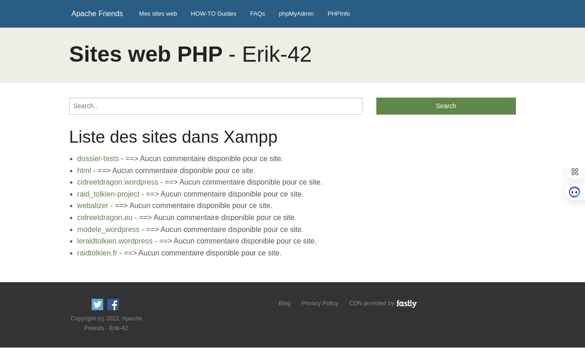

<div align="center">
</div>
<a name="readme-top"></a>

<!-- PROJECT LOGO -->
<br />
<div align="center">
  <h1>htdocs optimized</h1>
  <a href="https://github.com/Erik-42">
    
  </a>
</div>

<!-- TABLE OF CONTENTS -->
<details>
  <summary>Table of Contents</summary>
  <ol>
    <li> <a href="#about-the-project">About The Project</a></li>
     <li><a href="#installation">Installation</a></li>
    <li><a href="#usage">Usage</a></li>
    <li><a href="#built-with">Built With</a></li>
    <li><a href="#testez-le-projet">Testez le projet</a></li>
    <li><a href="#license">License</a></li>
    <li><a href="#contact">Contact</a></li>
  </ol>
</details>

<!-- ABOUT THE PROJECT -->

## About The Project

<div align="center">


[](https://wakatime.com/badge/github/Erik-42/htdocs-optimized)
[](https://wakatime.com/badge/user/f84d00d8-fee3-4ca3-803d-3daa3c7053a5/project/f399c8ca-204b-4b77-96ca-77946d4ce99e)

</div>

htdocs-optimized est une petite amélioration du dashboard de Xampp qui répertorie automatiquement les projets de sites web que vous créer dans le dossier `/htdocs/www-org`.

Cela vous permet de voir au premier coup d'oeil vos projets de sites et de les lancer.

## Installation

Copier simplement le dossier dashboard de ce github à la place de celui existant par défaut une fois Xamp installé.

Il se trouve généralement dans `/opt/lampp/htdocs`

Optionnel:

```
Si vous souhaitez exporter la structure du projet

`node export-file-structure.js`
```

<p align="right">(<a href="#readme-top">back to top</a>)</p>

## Usage

une fois Xampp lancé

- Nommé vos dossiers de projet de façon explicite

uploader votre projet dans un dossier dans le repertoire: `/opt/lampp/htdocs/www-org`<br/>
(pensez aux autorisations sous linux)
<br/>

ex: `/opt/lampp/htdocs/www-org/votre_projet/`

- Remplissez correctement les descriptions au début de vos fichiers `index.html` et `index.php`<br/>

exemple:

```html
<head>
	<meta
		name="description"
		content="votre site web sous Wordpress ou Joomla ou autre chose" />
	<title>Accueil de votre site web</title>
</head>
```

la page récupère automatiquement les noms de dossiers et les descriptions afin de les afficher.

<p align="right">(<a href="#readme-top">back to top</a>)</p>

## Built with

<p> </p>
<a href=https://github.com/Erik-42?tab=repositories&q=&type=&language=html&sort= >  </a>
<a href=https://github.com/Erik-42?tab=repositories&q=&type=&language=css&sort= >  </a>
<a href=https://github.com/Erik-42?tab=repositories&q=&type=&language=phps&sort= >  </a>
<a href= https://github.com/Erik-42?tab=repositories&q=&type=&language=github&sort= >  </a>

<p align="right">(<a href="#readme-top">back to top</a>)</p>

## Testez le projet

https://github.com/Erik-42/htdocs-optimized

<p align="right">(<a href="#readme-top">back to top</a>)</p>

## License

<br/>
Distributed under the GNU License. See `LICENSE.txt` for more information.

<p align="right">(<a href="#readme-top">back to top</a>)</p>

## Contact

<div align="center">

[![wakatime][wakatime-shield]][wakatime-url]
[![GitHub repo][github repo-shield]][github repo-url]


[![GitHub followers][github followers-shield]][github followers-url]
[![Stargazers][stars-shield]][stars-url]

[![Github Badge][github badge-shield]][github badge-url]
[![LinkedIn][linkedin-shield]][linkedin-url]

<a href = 'https://basillecorp.dev'>  basillecorp.dev</a>

Contactez moi: mesen.erik@gmail.com

</div>

<p align="right">(<a href="#readme-top">back to top</a>)</p>

<!-- MARKDOWN LINKS -->
<!-- https://www.markdownguide.org/basic-syntax/#reference-style-links -->

[wakatime-shield]: https://wakatime.com/badge/user/f84d00d8-fee3-4ca3-803d-3daa3c7053a5.svg
[wakatime-url]: https://wakatime.com/@f84d00d8-fee3-4ca3-803d-3daa3c7053a5
[github badge-shield]: https://img.shields.io/badge/Github-Erik--42-155?style=for-the-badge&logo=github
[github badge-url]: https://github.com/Erik-42
[github repo-shield]: https://img.shields.io/badge/repositories-58-blue
[github repo-url]: https://github.com/Erik-42/Erik-42?tab=repositories
[github followers-shield]: https://img.shields.io/github/followers/Erik-42
[github followers-url]: https://github.com/followers/Erik-42
[stars-shield]: https://img.shields.io/github/stars/Erik-42
[stars-url]: https://github.com/Erik-42?tab=stars
[linkedin-shield]: https://img.shields.io/badge/-LinkedIn-black.svg?style=for-the-badge&logo=linkedin&colorB=555
[linkedin-url]: https://www.linkedin.com/in/erik-mesen/
[repositories-shield]: https://img.shields.io/github/repositories/Erik-42
[repositories-url]: https://github.com/Erik-42?tab=repositories
